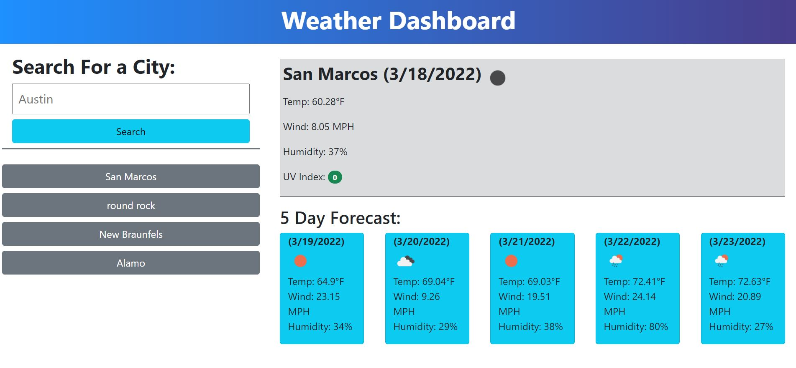

# Weather DashBoard
[WeatherDash Site](https://sabotagecat.github.io/weather-dash/)

## Description
This website's function is to present the current weather conditions for a user inputed city. A 5 day forecast also displays on the page with a search history being populated. The items within the search history list are also able to be selected and display weather results. 

## External Resources Used

- Bootstrap <link href="https://cdn.jsdelivr.net/npm/bootstrap@5.1.3/dist/css/bootstrap.min.css">
- Moment.js <script src="https://cdnjs.cloudflare.com/ajax/libs/moment.js/2.29.1/moment.min.js">
- OneCallAPI https://openweathermap.org/api/one-call-api
- Geocoding API https://openweathermap.org/api/geocoding-api

## Construction
This website was constructed using html to organize containers and add the heading text. Bootstrap and a stylesheet were added to decorate and organize the webpage. Moment.js was used to retrieve all the dates displayed on the webpage. The OneCallAPI was used in conjunction with the Geocoding API to retrieve weather data for the user inputed city search. 

## Author
Robert D Gonzales - https://github.com/SabotageCat / robert.gonzo13@yahoo.com
